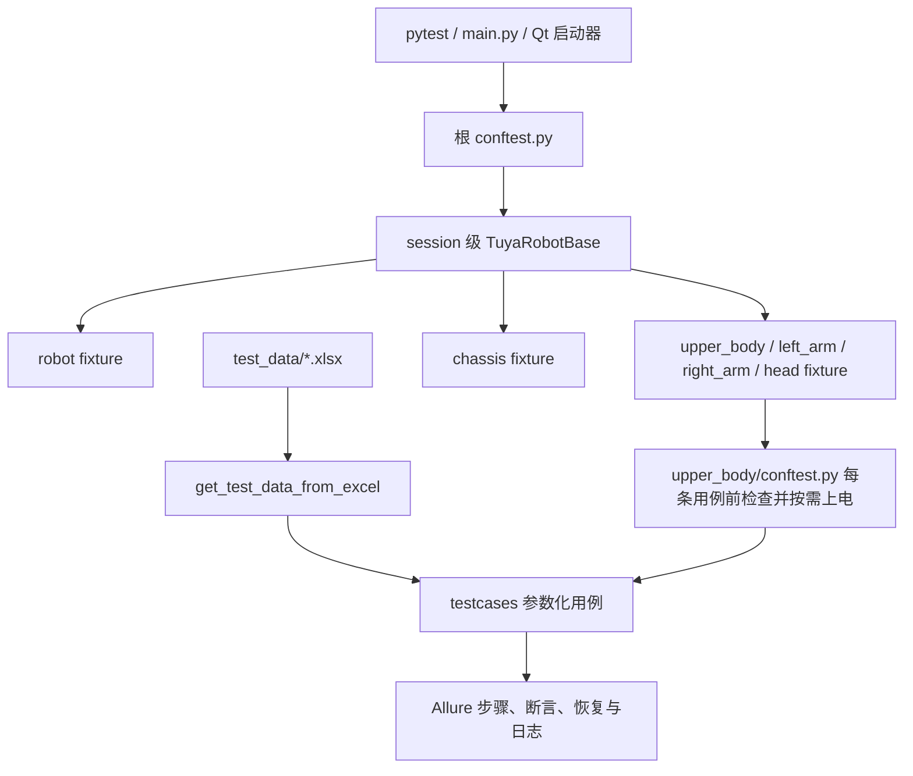

# TuyaRobot Pytest 自动化测试框架

本仓库基于 `pytest`、`allure-pytest`、`openpyxl` 和 `pytuyarobot`，用于 TuyaRobot 整机、上半身和底盘真机接口的 Excel 数据驱动测试。

当前收集基线：119 个测试文件、142 个测试函数、824 条参数化测试。

## 总体架构



## 目录职责

```text
Tuya_pytest/
├── common1/                    日志、Excel 读取、人工确认和断言工具
├── test_data/
│   ├── robot.xlsx             整机测试数据
│   ├── upper_body.xlsx        上半身、左右臂和头部测试数据
│   └── chassis.xlsx           底盘与升降机构测试数据
├── testcases/
│   ├── robot/                 整机接口测试
│   ├── upper_body/            上半身、左右臂、头部及运动接口测试
│   │   └── conftest.py        每条上半身用例前检查并按需执行双臂上电
│   └── chassis/               底盘与升降机构接口测试
├── qt_platform/               PyQt6 图形化测试启动器
├── docs/                      运动方案、交接记录和待确认事项
├── conftest.py                CLI、连接合并、session 设备、fixture 和安全门控
├── settings.py                连接配置、Excel 路径、公共运动常量和设备封装
├── pytest.ini                 收集目录、导入模式和 marker 注册
├── main.py                    命令行启动入口
└── requirements.txt           Python 依赖
```

## 核心组件

### `settings.py`

`TuyaConnectionConfig` 负责连接默认值和环境变量读取。配置优先级为：

```text
pytest CLI 显式参数 > 环境变量 > TuyaConnectionConfig 默认值
```

当前默认连接：

- 上半身：`192.168.0.232:6500`
- 头部：`COM4 / 115200`，默认不自动连接
- 底盘：`COM16 / 2000000`，默认不自动连接

`TuyaRobotBase` 负责：

- 集中创建并暴露 `robot`、`upper_body`、`left_arm`、`right_arm`、`head`、`chassis`。
- 公共恢复速度 `speed = 20`。
- 角度回读容差 `angle_tolerance = 0.1`，坐标回读容差 `coord_tolerance = 0.1`。
- 上半身左右臂零位偏移 `UPPER_BODY_ZERO_ANGLES`（`left` / `right`）。
- 双臂整臂回零使用 `TuyaRobotBase.go_zero()`；设置参数后的公共默认恢复动作同样集中在 `TuyaRobotBase`。
- 坐标运动前通过 `TuyaRobotBase.move_to_coord_initial_pose()` 将双臂移动到已确认的初始关节姿态；单臂坐标 Jog/步进传入 `left` 或 `right`，只移动目标臂。
- 初始姿态会按 `COORD_MOTION_INITIAL_COORDS` 回读校验；`send_upper_coord` 仅测试左右单臂在刷新和插补模式下的各轴正负运动。每条用例先进入初始姿态，再设置并回读模式，结束后双臂回零；模块结束固定恢复插补模式。
- J1～J7 软件限位 `UPPER_BODY_JOINT_SOFT_LIMITS`。
- `wait_upper(timeout=30)`：轮询左右臂运动状态并提供超时保护。
- 测试会话结束时统一关闭设备连接。

### 根 `conftest.py`

- 注册连接参数和安全门控参数。
- collection 阶段自动给 `testcases/` 下的测试添加 `hardware` marker。
- 创建唯一的 session 级 `TuyaRobotBase`。
- 提供 session 级子系统 fixture。
- `head`、`chassis` 未启用时由 fixture 跳过，不允许测试自行连接。

### `testcases/upper_body/conftest.py`

上半身目录使用 function 级自动 fixture。每条上半身测试开始前：

1. 调用 `is_upper_powered_on()` 读取左右臂状态。
2. 状态已经是 `[1, 1]` 时直接进入测试。
3. 未全部上电时调用 `upper_power_on()`。
4. 最多等待 30 秒，确认左右臂均完成上电。

上半身测试文件不再重复编写前置上电检查。

## Excel 数据驱动

- 一个接口对应一个测试文件和一个同名 Sheet。
- 首行为字段名，通过 `get_test_data_from_excel()` 读取。
- 用例 `ID` 使用从 1 开始的连续纯数字，不添加接口缩写前缀。
- `title` 描述实际验证功能与关键参数，不复述 ID 或 API 名。
- normal、exception、manual 等分类只读取 Excel 的 `test_type`，代码不二次推断或重分类。
- 参数化固定使用：

```python
@pytest.mark.parametrize("case", cases, ids=lambda c: c["title"])
```

## 测试编写约定

- 测试文件只使用 pytest fixture，不自行创建或关闭设备连接。
- 接口调用、等待、断言和恢复流程直接写在测试函数中。
- 不使用 `_run_*`、Executor、Adapter 等方式封装测试主流程。
- 新增任何测试公共方法前必须先取得用户明确确认。
- 每条用例包含开始、通过、完成日志，并记录真实 API 入参。
- Allure 的功能、场景、步骤和附件标题使用简体中文，API 名仅作为中文描述中的接口标识保留。
- API 调用、前置动作、断言和恢复使用语义明确的 `allure.step`。
- 先断言返回类型和结构，再断言业务值；运动回读使用 `assert_almost_equal` 和 `TuyaRobotBase` 中的对应容差。
- Excel 的 `expect_data` 统一断言接口业务数据；左臂、右臂和整臂返回均通过 `TuyaRobotBase.result_data()` 提取，无需在测试中重复判断 `CommandResult`，也无需按 `plain_return` 模式重复建列。
- 普通设置接口成功业务返回值断言为 `1`；运动发送接口按模式断言，插补模式返回 `0`，刷新模式返回 `1`；查询接口按实际查询数据断言。
- 异常测试使用 SDK 具体异常类型，并在 `pytest.raises(...)` 块结束后记录 `exc.value`。
- 状态修改和运动测试使用 `try/finally` 完成恢复，不吞掉恢复异常。

### `send_upper_angle` 顺序

`send_upper_angle` 显式区分刷新模式 `1` 和插补模式 `0`：

1. 左右单臂分别覆盖两种模式下的 J1～J7 普通角度及软件限位运动。
2. 双臂使用 `robot.send_upper_angle` 覆盖两种模式下 J1～J7 正负 10°，不执行双臂软件限位。
3. 每条关节用例在 `finally` 中回零，避免目标叠加成未经确认的组合姿态。
4. 模块全部用例结束后固定恢复双臂插补模式 `0`。

整臂回零使用 `TuyaRobotBase.UPPER_BODY_ZERO_ANGLES`（左右臂各自偏移角）和 `TuyaRobotBase.speed`。

## 安全门控

所有真机测试默认跳过，必须显式开启所需门控：

| Marker | CLI | 环境变量 | 用途 |
|---|---|---|---|
| `hardware` | `--run-hardware` | `RUN_TUYA_HARDWARE` | 连接真机 |
| `motion` | `--run-motion` | `RUN_TUYA_MOTION` | 允许设备运动 |
| `manual` | `--run-manual` | `RUN_TUYA_MANUAL` | 需要人工确认 |
| `danger` | `--run-danger` | `RUN_TUYA_DANGER` | 校准、软限位等高风险操作 |
| `firmware` | `--run-firmware` | `RUN_TUYA_FIRMWARE` | 固件测试 |

同一用例包含多个 marker 时，必须分别开启所有门控。`reset` 仅表示用例会恢复状态，不是执行门控。

普通验证不得携带真机门控：

```powershell
python -m compileall -q testcases
pytest testcases --collect-only -q
pytest --help
```

## 运行方式

### Cursor 或终端

`-s` 用于实时显示日志：

```powershell
pytest -s testcases/upper_body --run-hardware --run-motion --no-connect-chassis
```

精确软件限位等高风险运动还需要：

```powershell
pytest -s testcases/upper_body --run-hardware --run-motion --run-manual --run-danger --no-connect-chassis
```

连接头部时增加 `--connect-head`。不连接底盘时使用 `--no-connect-chassis`。

### 命令行入口

```powershell
python main.py --module robot --run-hardware
python main.py --module upper_body --allure --run-hardware --run-motion
```

### 图形启动器

```powershell
python -m qt_platform
```

## 日志与 Allure

运行日志写入：

```text
log/tuya_robot.log
```

实时查看日志：

```powershell
Get-Content .\log\tuya_robot.log -Wait -Tail 30
```

生成 Allure 原始数据和报告：

```powershell
pytest -s testcases --alluredir=allure-results
allure generate allure-results -o allure-report --clean
```

## 相关文档

- `docs/MOTION_TEST_PLAN.md`：运动接口范围、已确认数据和安全策略。
- `docs/HANDOFF_2026-07-17_MOTION_TESTS.md`：运动测试交接记录。
- `docs/PENDING_CONFIRMATION.md`：高风险或协议不明确接口的待确认项。
- `AGENTS.md`、`.cursorrules`：仓库强制规则。
